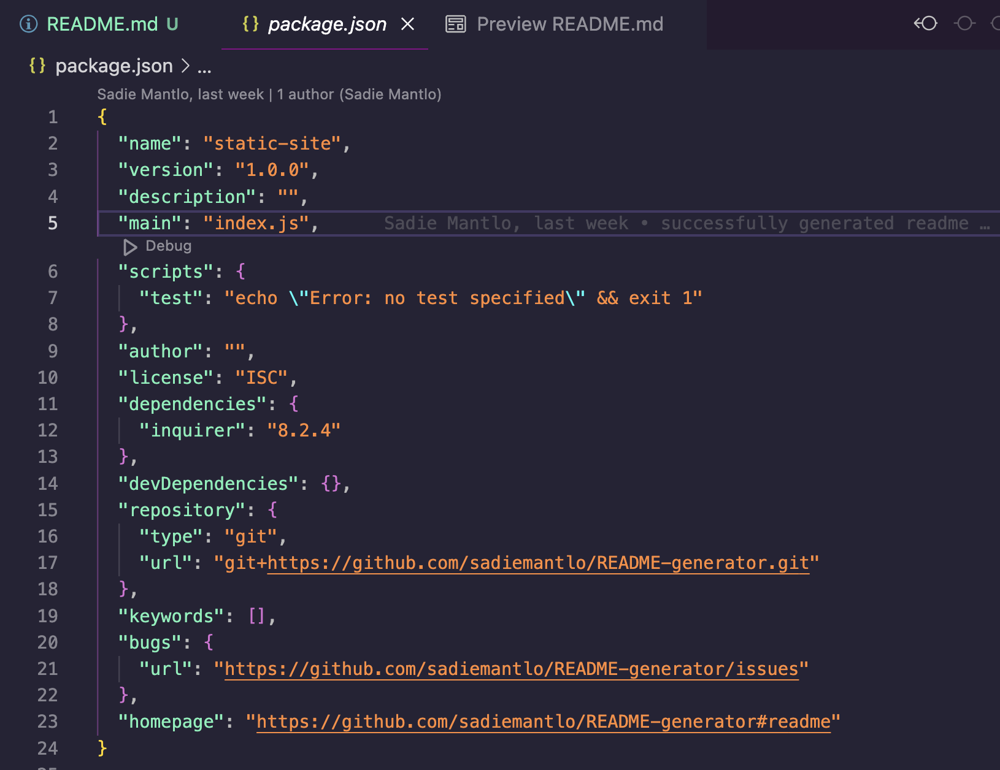

# **README Generator**

## **Description**

This application is a README generator that uses user input to create a README file for the users project. 

## **Installation**

This application uses inquirer to generate the questions that are asked. To intall what is needed for this application, run "npm i inquirer@8.2.4" in the terminal.

## **Usage**

To use this application, run "node index.js" in the terminal and a series of questions will pop up. Your answers to the questions will then be used to populate your READEME file, which will be automatically generated after all the questions are answered. To watch a video on how to use this application, click [here](https://drive.google.com/file/d/1ClFI3XG_9BvxDD89VvFFYoY7DSv9LknE/view). The sample README that was generated in the video is [here](./READMEsample.md).

Here is a screen shot of what your JSON package should look like if installed properly. Note: make sure you have inquirer version 8.2.4 installed for it to work. 